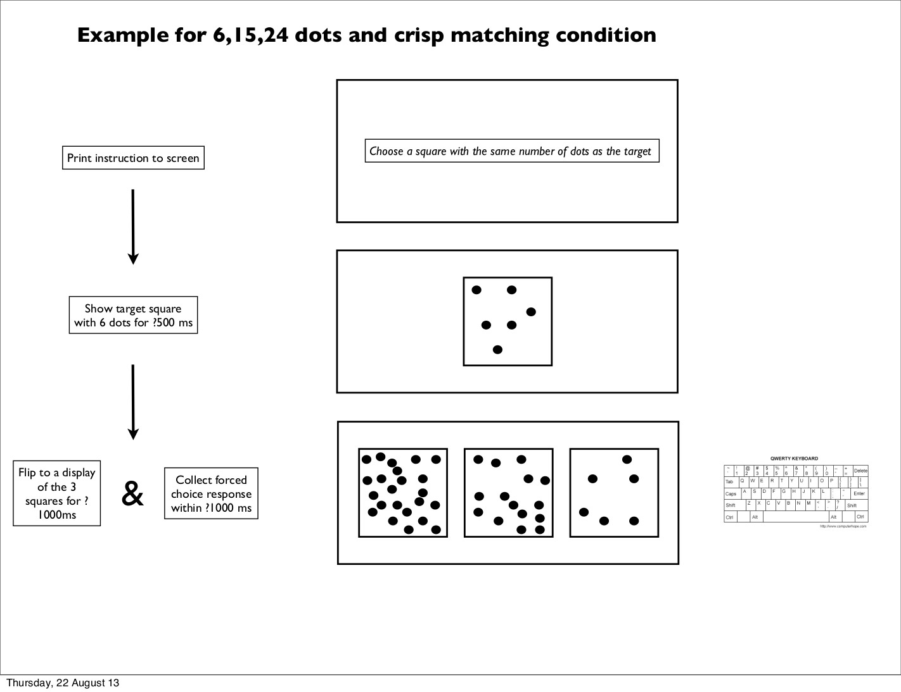

---
title: "E exp 3"
author: "Matt Green"
output:
  html_document:
    toc: true
    toc_float: false
---  

```{r, "libs and functions", echo=FALSE, message=FALSE}
library(knitr)
library(tidyverse)
library(broom)
library(broom.mixed)
library(lme4)
library(lmerTest)
library(dotwhisker)
library(kableExtra)
library(LMERConvenienceFunctions)
library(data.table)
library(gridExtra)
source("E_exp_3_functions/preprocessing.R")
source("E_exp_3_functions/pretty_coef_table.R")
source("E_exp_3_functions/summarySEwithin2.R")
root_dir <- getwd()
data_dir <- "E_exp_3_data"
```

```{r, get_data}
dat_full <- preprocessing(root_dir, data_dir)
dat <- subset(dat_full, RT>0 & RT<9500)
dat_borderline <- dat
dat <- perSubjectTrim.fnc(dat, response='RT', subject='Subject', trim = 2.5)$data
dat$RT_log <- log(dat$RT)
```

# Info and Procedure (Method)

The distinctive thing in this experiment is that in order to avoid mentioning a number, we had to show a "Target" (similar to a prime) that presented an array with a certain number of dots which we could later refer to as "the target" in expressions like "the same number of dots as the target".

RTs were overwhelmingly faster in this experiment than in experiments where numbers were used in the instructions.

Each subject saw 192 trials, being 3 cycles of 64 trials. There were 40 subjects. There were 7680 rows in the full data.

First an instruction was presented until subjects dismissed it with a key press. Then a grey screen was presented for 1 second. Then a prime was presented for 2 seconds. Then a grey screen was presented for 1 second. Then the squares with dots were presented until the subject responded, with a 10 second timeout if they did not respond.

# Sample display

<figure>

<figcaption>Flow of experiment E_exp_3.</figcaption>
</figure>


# Full table of instructions

```{r, "Full table of instructions", echo=FALSE}
instructions_table <- 
  dat %>%
    select(Item, Target, Quantity, Vagueness, Selection, Instruction) %>%
    unique() %>%
    arrange(Item, Target, Quantity, Vagueness, Selection) %>%
    spread(key=Vagueness, value=Instruction)
instructions_table %>% 
  kable(align='ccccll', caption="Full table of instructions") %>% 
      kable_styling(full_width = F, position = "left", font_size = 11) 
```

# Means plots

```{r, "make data for rt plot"}
dat_plot <- summarySEwithin2(dat, measurevar="RT_log", withinvars=c("Vagueness", "Selection", "Item"), idvar="Subject")
```

```{r, "EXP_E_rt_means_plot", fig.width=7, fig.height=3, echo=FALSE}
dodge = position_dodge(width=0.2)
dat_plot$Condition <- as.factor(paste(sep=' ', dat_plot$Selection, dat_plot$Vagueness))
ggplot(dat_plot, aes(y=RT_logNormed, x=Item, ymin=RT_logNormed-ci, ymax=RT_logNormed+ci, group=Condition, shape=Condition, fill=Condition)) +
  geom_line(position=dodge) +
  geom_errorbar(width=.2, position=dodge) +
  geom_point(size=2, position=dodge) +
  scale_shape_manual("",values = c(22, 22, 21, 21)) +
  scale_fill_manual("",values=c("black","white","black","white")) +
  ggtitle("Response time") +
  ylab("Respone time (log (ms))") + 
  xlab("") +
  theme_bw() +
  theme(panel.grid.major = element_blank(), panel.grid.minor = element_blank(),
        legend.key = element_blank(), aspect.ratio=1,
        axis.text.x = element_text(angle = 45, hjust = 1),
        plot.background=element_rect(fill=NA, color='white')) +
  facet_grid(~Selection) 
```

```{r, "EXP_E_Borderline_response_distribution_plot", fig.width=7, fig.height=3, echo=FALSE}
dat_borderline$response_cat <- factor(dat_borderline$response_cat, levels= c("Near", "Expected", "Far"))
ggplot(dat_borderline) + 
  geom_bar(aes(response_cat, group=Selection:Vagueness, fill=Vagueness), position=position_dodge(width=NULL)) +   
  scale_fill_grey() + 
  xlab(NULL) + 
  ggtitle('Borderline response distribution') + 
  facet_grid(~Selection) +
  theme_bw() + 
  theme(panel.grid.major = element_blank(), panel.grid.minor = element_blank(), legend.key = element_blank(), legend.position="top", aspect.ratio=1, plot.background = element_rect(fill=NA, color='white'), strip.background=element_blank(), legend.key.size=unit(4, 'mm'), axis.text.x = element_text(angle = 15))
```

# Hypotheses

We formulated the following hypotheses:

* [Hypothesis 1] Crisp/Vague RT:
    * Vague instructions should result in faster responses than crisp instructions.
* [Hypothesis 2] Comparison/Matching RT:
    * Instructions that allow comparison should result in faster responses than instructions that necessitate matching.
* [Hypothesis 3] Vagueness effect differs between comparison and matching: 
    * The effects of vagueness should differ when the selection task is comparison versus when it is matching.

# Results

An initial observation is that response times were much faster than in our previous experiments. It seems that when there are no numbers in the instructions, and the instructions refer to a previously-seen trial-initial array, participants are able to resolve those instructions an order of magnitude more quickly than when the instructions use numbers, and make no reference to any previously-seen trial-initial array.

Response times were trimmed at 9,500 ms, resulting in the loss of 9 trials that were judged to have outlier RTs. The remaining data were trimmed separately for each participant at 2.5 standard deviations below and above that participant's mean RT, leading to the loss of 211 trials (2.8% of the remaining trials). RTs in milliseconds were log-transformed so that they better approximated a normal distribution for the purposes of analysis.

## The first set of models

```{r, "rt_lmer_full_model_all_items", cache=TRUE}
dat_model <- dat
dat_model$c_Vag <- ifelse(dat_model$Vagueness=="Crisp", -0.5, 0.5)
dat_model$c_Sel <- ifelse(dat_model$Selection=="Comparison", -0.5, 0.5)
dat_model$c_Itm <- ifelse(dat_model$Item=="06:15:24", -.75, ifelse(dat_model$Item=="16:25:34", -.25, ifelse(dat_model$Item=="26:35:44", .25, .75)))
rtlmer = lmerTest::lmer(data=dat_model, RT_log ~ c_Vag * c_Sel + c_Itm + (1 + c_Vag * c_Sel + c_Itm | Subject))
pretty_coef_table(rtlmer, "rt_lmer_full_model_all_items")
```

```{r, "rt_lmer_for_comparison_all_items", cache=TRUE}
dat_model <- subset(dat, subset=Selection=='Comparison')
dat_model$c_Vag <- ifelse(dat_model$Vagueness=="Crisp", -0.5, 0.5)
dat_model$c_Itm <- ifelse(dat_model$Item=="06:15:24", -.75, ifelse(dat_model$Item=="16:25:34", -.25, ifelse(dat_model$Item=="26:35:44", .25, .75)))
comp_lmer <- lmerTest::lmer(data=dat_model, RT_log ~ c_Vag + c_Itm + (1 + c_Vag + c_Itm | Subject))
pretty_coef_table(comp_lmer, "rt_lmer_for_comparison_all_items")
```

```{r "rt_lmer_for_matching_all_items", cache=TRUE}
dat_model <- subset(dat, subset=Selection=='Matching')
dat_model$c_Vag <- ifelse(dat_model$Vagueness=="Crisp", -0.5, 0.5)
dat_model$c_Itm <- ifelse(dat_model$Item=="06:15:24", -.75, ifelse(dat_model$Item=="16:25:34", -.25, ifelse(dat_model$Item=="26:35:44", .25, .75)))
match_lmer <- lmerTest::lmer(data=dat_model, RT_log ~ c_Vag + c_Itm + (1 + c_Vag + c_Itm | Subject))
pretty_coef_table(match_lmer, "rt_lmer_for_matching_all_items")
```

Considering the first set of models:

* [Hypothesis 1] Crisp/Vague RT:
    * _Vague instructions should result in faster responses than crisp instructions_ : Vague instructions resulted in faster responses than crisp instructions, but this effect was very small and not significant (p=0.13)
* [Hypothesis 2] Comparison/Matching RT:
    * _Instructions that allow comparison should result in faster responses than instructions that necessitate matching_ : Comparison instructions resulted in faster responses than matching and this difference was significant (p<0.001)
* [Hypothesis 3] Vagueness effect differs between comparison and matching:
    * _The effects of vagueness should differ when the selection task is comparison versus when it is matching_ : Vague instructions did have different effects depending on whether the selection task is comprison or matching (p<0.001). In the comparison condition vague instructions resulted in significantly faster responses (p<0.001). In the selection condition vague instructions slowed down responses significantly (p<0.001)
    
## The second set of models

The second set of models considered were conducted to test for main effects _in the presence of interactions involving those main effects_ (after Levy, 2018)

# Discussion